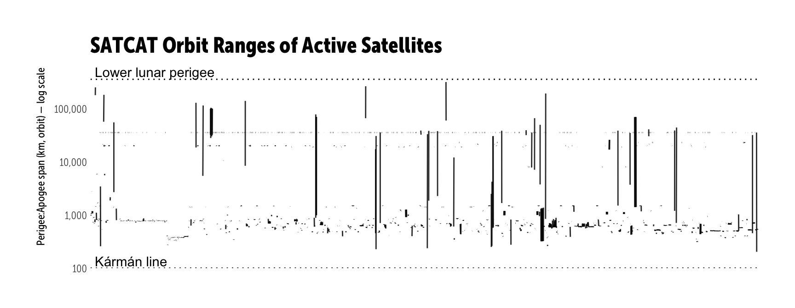

`satcat` : Tools to Work with the 'CelesTrak' Satellite Catalog API

T.S. Kelso has been transcribing NORAD's "resident space object" data for decades. One component of of this is the 'SATCAT' satellite catalog (<https://celestrak.com/satcat/search.asp>), which provides data on all known satellites launched since 1957.

Data source pkg inspired by mention on [Data Is Plural](http://tinyletter.com/data-is-plural/letters/data-is-plural-2017-01-11-edition).

The following functions are implemented:

-   `read_satcat`: Read in a complete SATCAT database complete with expanded status code, site code and launch source codes.

### Installation

``` r
devtools::install_github("hrbrmstr/satcat")
```

``` r
options(width=120)
```

### Usage

``` r
library(satcat)
library(dplyr)
library(ggplot2)

# current verison
packageVersion("satcat")
```

    ## [1] '0.1.0'

``` r
satcat_df <- read_satcat()

glimpse(satcat_df)
```

    ## Observations: 41,927
    ## Variables: 20
    ## $ designator            <chr> "1957-001A", "1957-001B", "1957-002A", "1958-001A", "1958-002B", "1958-003A", "1958-0...
    ## $ norad_cat_num         <chr> "00001", "00002", "00003", "00004", "00005", "00006", "00007", "00008", "00009", "000...
    ## $ multiple              <lgl> FALSE, FALSE, FALSE, FALSE, FALSE, FALSE, FALSE, FALSE, FALSE, FALSE, FALSE, FALSE, F...
    ## $ payload               <lgl> FALSE, TRUE, TRUE, TRUE, TRUE, TRUE, FALSE, TRUE, TRUE, TRUE, TRUE, FALSE, TRUE, TRUE...
    ## $ op_status_code        <chr> "D", "D", "D", "D", "", "D", "D", "D", "D", "D", "", "", "D", "D", "D", "", "D", "D",...
    ## $ satellite_name        <chr> "SL-1 R/B", "SPUTNIK 1", "SPUTNIK 2", "EXPLORER 1", "VANGUARD 1", "EXPLORER 3", "SL-1...
    ## $ source                <chr> "CIS", "CIS", "CIS", "US", "US", "US", "CIS", "CIS", "US", "US", "US", "US", "US", "U...
    ## $ launch_date           <date> 1957-10-04, 1957-10-04, 1957-11-03, 1958-02-01, 1958-03-17, 1958-03-26, 1958-05-15, ...
    ## $ launch_site           <chr> "TYMSC", "TYMSC", "TYMSC", "AFETR", "AFETR", "AFETR", "TYMSC", "TYMSC", "AFETR", "AFE...
    ## $ decay_date            <date> 1957-12-01, 1958-01-03, 1958-04-14, 1970-03-31, NA, 1958-06-28, 1958-12-03, 1960-04-...
    ## $ orbital_period        <dbl> 96.2, 96.1, 103.7, 88.5, 132.8, 103.6, 102.7, 88.4, 92.8, 98.2, 121.5, 125.9, 92.7, 9...
    ## $ inclination           <dbl> 65.1, 65.0, 65.3, 33.2, 34.2, 33.5, 65.1, 65.1, 50.3, 32.3, 32.9, 32.9, 90.0, 89.9, 4...
    ## $ apogee                <dbl> 938, 945, 1659, 215, 3832, 1739, 1571, 255, 585, 1187, 2940, 3329, 697, 346, 42276, 4...
    ## $ perigee               <dbl> 214, 227, 211, 183, 652, 117, 206, 139, 239, 159, 554, 554, 114, 239, 251, 651, 198, ...
    ## $ radar_cross_section   <dbl> 20.4200, NA, 0.0800, NA, 0.1204, NA, NA, 11.8400, NA, NA, 0.3910, 0.5281, NA, NA, NA,...
    ## $ orbital_status_code   <chr> "", "", "", "", "", "", "", "", "", "", "", "", "", "", "", "", "", "", "", "", "", "...
    ## $ source_full_name      <chr> "Commonwealth of Independent States (former USSR)", "Commonwealth of Independent Stat...
    ## $ launch_site_full_name <chr> "Tyuratam Missile and Space Center, Kazakhstan (Also known as Baikonur Cosmodrome)", ...
    ## $ op_status_descr       <chr> "Decayed", "Decayed", "Decayed", "Decayed", NA, "Decayed", "Decayed", "Decayed", "Dec...
    ## $ is_active             <lgl> FALSE, FALSE, FALSE, FALSE, FALSE, FALSE, FALSE, FALSE, FALSE, FALSE, FALSE, FALSE, F...

``` r
dplyr::filter(satcat_df, is_active, perigee!=0) -> df
```

``` r
ggplot() +
  geom_segment(data=df, 
               aes(x=designator, xend=designator, y=apogee, yend=perigee),
               size=0.5, alpha=5/6, position=position_jitter()) +
  geom_hline(yintercept=c(100, 360000), linetype='dotted') +
  geom_text(data=data_frame(), 
            aes(x=c(10, 10), y=c(110, 400000), 
                label=c("Kármán line", "Lower lunar perigee")),
            vjust=0, hjust=0) +
  scale_y_continuous(name="Perigee:Apogee span (km, orbit) — log scale", label=scales::comma,
                     expand=c(0,0), limits=c(100,600000), trans="log10") +
  labs(x=NULL, title="SATCAT Orbit Ranges of Active Satellites") +
  hrbrmisc::theme_hrbrmstr_msc(grid="") +
  theme(axis.text.x=element_blank()) +
  theme(axis.ticks.x=element_blank())
```



``` r
# How many satellites launched per source (country) [top 20]

count(satcat_df, source_full_name, sort=TRUE) %>%
  mutate(ct=scales::comma(n), pct=scales::percent(n/sum(n))) %>%
  select(-n) %>%
  print(n=20)
```

    ## # A tibble: 87 × 3
    ##                                                     source_full_name     ct   pct
    ##                                                                <chr>  <chr> <chr>
    ## 1                   Commonwealth of Independent States (former USSR) 21,413 51.1%
    ## 2                                                      United States 11,731 28.0%
    ## 3                                         People's Republic of China  5,081 12.1%
    ## 4                                                             France  1,250  3.0%
    ## 5                                                              Japan    529  1.3%
    ## 6                                                              India    520  1.2%
    ## 7                                              European Space Agency    171  0.4%
    ## 8                                        International Space Station    104  0.2%
    ## 9                                                       China/Brazil     91  0.2%
    ## 10 International TelecommunicationsSatellite Organization (INTELSAT)     88  0.2%
    ## 11                                                        Globalstar     86  0.2%
    ## 12                                                           Germany     68  0.2%
    ## 13                                                           ORBCOMM     60  0.1%
    ## 14                                                               SES     56  0.1%
    ## 15                                                            Canada     54  0.1%
    ## 16                                                    United Kingdom     54  0.1%
    ## 17      European TelecommunicationsSatellite Organization (EUTELSAT)     52  0.1%
    ## 18                                                             Italy     37  0.1%
    ## 19                                                        Sea Launch     37  0.1%
    ## 20                                                            Israel     26  0.1%
    ## # ... with 67 more rows

``` r
# How many satellites launched per source (country) that are still active? [top 20]

filter(satcat_df, is_active) %>%
  count(source_full_name, sort=TRUE) %>%
  mutate(ct=scales::comma(n), pct=scales::percent(n/sum(n))) %>%
  select(-n) %>%
  print(n=20)
```

    ## # A tibble: 76 × 3
    ##                                                     source_full_name    ct   pct
    ##                                                                <chr> <chr> <chr>
    ## 1                                                      United States   544 34.0%
    ## 2                                         People's Republic of China   193 12.1%
    ## 3                   Commonwealth of Independent States (former USSR)   145  9.1%
    ## 4                                                              Japan    77  4.8%
    ## 5                                                                SES    48  3.0%
    ## 6                                                              India    47  2.9%
    ## 7                                              European Space Agency    44  2.8%
    ## 8                                                            ORBCOMM    42  2.6%
    ## 9  International TelecommunicationsSatellite Organization (INTELSAT)    35  2.2%
    ## 10                                                        Globalstar    34  2.1%
    ## 11      European TelecommunicationsSatellite Organization (EUTELSAT)    33  2.1%
    ## 12                                                            Canada    30  1.9%
    ## 13                                                           Germany    26  1.6%
    ## 14                                                    United Kingdom    21  1.3%
    ## 15                                                            France    20  1.3%
    ## 16                                                             Spain    15  0.9%
    ## 17                                                            Israel    12  0.8%
    ## 18                                                             Italy    12  0.8%
    ## 19                                                      O3b Networks    12  0.8%
    ## 20                                                            Brazil    11  0.7%
    ## # ... with 56 more rows

``` r
# What's the most popular launch site? [top 20]

count(satcat_df, launch_site_full_name, sort=TRUE) %>%
  mutate(ct=scales::comma(n), pct=scales::percent(n/sum(n))) %>%
  select(-n) %>%
  mutate(launch_site_full_name=abbreviate(launch_site_full_name, 80)) %>%
  print(n=20)
```

    ## Warning in abbreviate(c("Tyuratam Missile and Space Center, Kazakhstan (Also known as Baikonur Cosmodrome)", :
    ## abbreviate used with non-ASCII chars

    ## # A tibble: 31 × 3
    ##                                                        launch_site_full_name     ct   pct
    ##                                                                        <chr>  <chr> <chr>
    ## 1    TyuratamMissileandSpaceCenter,Kazakhstan(AlsoknownasBaikonurCosmodrome) 11,173 26.6%
    ## 2                                 Plesetsk Missile and Space Complex, Russia 11,008 26.3%
    ## 3                              Air Force Western Test Range, California, USA  6,933 16.5%
    ## 4                                                  Taiyuan Space Center, PRC  4,362 10.4%
    ## 5                                 Air Force Eastern Test Range, Florida, USA  3,855  9.2%
    ## 6                                  Europe's Spaceport, Kourou, French Guiana  1,697  4.0%
    ## 7   Satish Dhawan Space Centre, India (Formerly Sriharikota Launching Range)    569  1.4%
    ## 8                                               Xichang Launch Facility, PRC    425  1.0%
    ## 9                                                  Jiuquan Space Center, PRC    408  1.0%
    ## 10                            Kapustin Yar Missile and Space Complex, Russia    404  1.0%
    ## 11                                           Tanegashima Space Center, Japan    322  0.8%
    ## 12                                             Wallops Island, Virginia, USA    158  0.4%
    ## 13 UchinouraSpaceCenter(FomerlyKagoshimaSpaceCenter—UniversityofTokyo,Japan)    143  0.3%
    ## 14                                          Dombarovskiy Launch Site, Russia    114  0.3%
    ## 15                                              Sea Launch Platform (mobile)     69  0.2%
    ## 16                                                    Eastern Range Airspace     57  0.1%
    ## 17                                     Hammaguira Space Track Range, Algeria     48  0.1%
    ## 18                                                    Western Range Airspace     48  0.1%
    ## 19                                          Svobodnyy Launch Complex, Russia     20  0.0%
    ## 20                           San Marco Launch Platform, Indian Ocean (Kenya)     17  0.0%
    ## # ... with 11 more rows

``` r
# What's the most popular launch site this century? [top 20]

filter(satcat_df, lubridate::year(launch_date) >= 2000) %>%
  count(launch_site_full_name, sort=TRUE) %>%
  mutate(ct=scales::comma(n), pct=scales::percent(n/sum(n))) %>%
  select(-n) %>%
  mutate(launch_site_full_name=abbreviate(launch_site_full_name, 80)) %>%
  print(n=20)
```

    ## Warning in abbreviate(c("Tyuratam Missile and Space Center, Kazakhstan (Also known as Baikonur Cosmodrome)", :
    ## abbreviate used with non-ASCII chars

    ## # A tibble: 27 × 3
    ##                                                        launch_site_full_name    ct   pct
    ##                                                                        <chr> <chr> <chr>
    ## 1    TyuratamMissileandSpaceCenter,Kazakhstan(AlsoknownasBaikonurCosmodrome) 2,307 34.0%
    ## 2                              Air Force Western Test Range, California, USA   892 13.1%
    ## 3                                 Air Force Eastern Test Range, Florida, USA   630  9.3%
    ## 4   Satish Dhawan Space Centre, India (Formerly Sriharikota Launching Range)   542  8.0%
    ## 5                                  Europe's Spaceport, Kourou, French Guiana   474  7.0%
    ## 6                                               Xichang Launch Facility, PRC   356  5.2%
    ## 7                                 Plesetsk Missile and Space Complex, Russia   346  5.1%
    ## 8                                                  Taiyuan Space Center, PRC   320  4.7%
    ## 9                                                  Jiuquan Space Center, PRC   303  4.5%
    ## 10                                           Tanegashima Space Center, Japan   219  3.2%
    ## 11                                          Dombarovskiy Launch Site, Russia   114  1.7%
    ## 12                                              Sea Launch Platform (mobile)    65  1.0%
    ## 13                                             Wallops Island, Virginia, USA    63  0.9%
    ## 14 UchinouraSpaceCenter(FomerlyKagoshimaSpaceCenter—UniversityofTokyo,Japan)    25  0.4%
    ## 15                                                    Western Range Airspace    22  0.3%
    ## 16                                     Wenchang Satellite Launch Center, PRC    16  0.2%
    ## 17                                        Kodiak Launch Complex, Alaska, USA    14  0.2%
    ## 18                                                    Eastern Range Airspace    13  0.2%
    ## 19                                          Svobodnyy Launch Complex, Russia    13  0.2%
    ## 20                                           US Army Kwajalein Atoll (USAKA)    13  0.2%
    ## # ... with 7 more rows

### Test Results

``` r
library(satcat)
library(testthat)

date()
```

    ## [1] "Sat Jan 14 22:29:35 2017"

``` r
test_dir("tests/")
```

    ## testthat results ========================================================================================================
    ## OK: 1 SKIPPED: 0 FAILED: 0
    ## 
    ## DONE ===================================================================================================================
    ## :)
